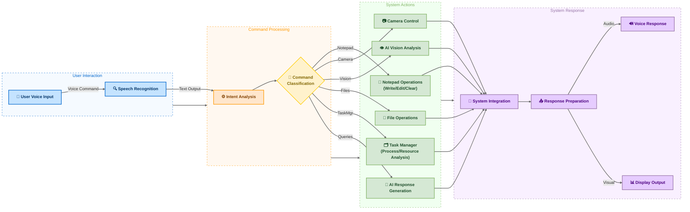

# Liam (Language Intergraded Adaptive Machine) AI

<p align="center">
  
</p>

<p align="center">
  
  
  
  
  
  
</p>

## Executive Summary

Liam AI is a Python-based voice assistant that enables users to control their Windows computer using natural language voice commands. It leverages advanced language models for intent recognition and can interact with system applications, especially Notepad, using robust automation and fallback strategies.

## Core Technology

Liam AI integrates several technologies:

- **Natural Language Processing**: Uses OpenAI GPT-4o or GitHub Copilot models for understanding and generating responses.
- **Speech Recognition**: Converts spoken language to text using SpeechRecognition and Google Speech API.
- **Text-to-Speech Synthesis**: Provides audible responses using Microsoft pyttsx3 or ElevenLabs (if API key is provided). ElevenLabs is preferred for higher quality, with fallback to Microsoft TTS.
- **System & Application Integration**: Automates Notepad and other applications using Windows APIs (win32gui, win32com), with multiple fallback methods (clipboard, PyAutoGUI, temp files) for reliability.
- **Waiting Sounds**: Plays short waiting sounds (e.g., "uhhh", "umm") while processing, using sounddevice and soundfile.
- **Camera Support**: Includes a camera manager for future expansion.
- **AI Vision**: Can analyze real-time camera feed to describe the scene, identify objects, and text.

## Key Capabilities

| Feature                       | Description                                                                                          |
| ----------------------------- | ---------------------------------------------------------------------------------------------------- |
| **Voice Command Recognition** | Understands and processes natural language instructions                                              |
| **System Control**            | Manages Notepad and can open/close other applications (browser, terminal)                            |
| **Notepad Automation**        | Writes, appends, and clears content in Notepad using robust fallback logic                           |
| **File Operations**           | Creates text files and writes dictated content                                                       |
| **Speech Synthesis**          | Speaks responses using ElevenLabs (if available) or Microsoft TTS                                    |
| **Waiting Feedback**          | Plays short sounds while processing to indicate activity                                             |
| **AI Vision**                 | Describes the camera view in real-time, identifies objects, and reads text using OCR (if enabled).   |
| **Task Manager**              | Analyzes and describes running processes, system resource usage, and can find or terminate processes |

## Roadmap: How Liam AI Works



## Technical Requirements

- Python 3.8+
- OpenAI API key or GitHub Copilot authentication (prompted on first run if not set)
- Optional: ElevenLabs API key for enhanced voice quality
- Windows OS (Notepad automation is Windows-specific)
- Microphone and speakers

## Quick Start

### Automated Setup (Recommended)
```bash
# Clone the repository
git clone https://github.com/awiones/Liam-Ai.git
cd Liam-Ai

# Run the setup script
python setup.py

# Edit the .env file with your API keys
# Then start Liam AI
python main.py
```

### Manual Installation

1. **Prerequisites**:
   - Python 3.8 or higher
   - Microphone and speakers
   - Camera (optional, for AI vision features)

2. **Installation**:
   ```bash
   # Install dependencies
   pip install -r requirements.txt
   
   # For Windows users (PyAudio installation)
   pip install pipwin
   pipwin install pyaudio
   ```

3. **Configuration**:
   Create a `.env` file with your API keys:
   ```env
   # Choose one of these AI providers
   GITHUB_TOKEN=your_github_copilot_token    # Recommended
   OPENAI_API_KEY=your_openai_api_key        # Alternative
   
   # Optional: Premium voice (ElevenLabs)
   ELEVENLABS_API_KEY=your_elevenlabs_key
   ```

4. **Launch**:
   ```bash
   python main.py
   ```

## Configuration

Liam AI uses a configuration system that allows you to customize behavior:

- **Audio Settings**: Voice rate, volume, TTS provider
- **Camera Settings**: Resolution, AI vision intervals
- **AI Settings**: Model selection, token limits
- **Security Settings**: Input validation, logging

Configuration is automatically created on first run and can be modified in `liam_config.json`.

## Troubleshooting

### Common Issues

1. **PyAudio Installation Error (Windows)**:
   ```bash
   pip install pipwin
   pipwin install pyaudio
   ```

2. **Camera Not Working**:
   - Check camera permissions
   - Ensure no other applications are using the camera
   - Try different camera indices in the configuration

3. **Speech Recognition Issues**:
   - Check microphone permissions
   - Ensure microphone is not muted
   - Test with different microphones

4. **API Key Errors**:
   - Verify API key format and validity
   - Check internet connection
   - Ensure sufficient API credits/quota

## Practical Applications

- **Accessibility**: Enables hands-free computer use, especially for users with mobility challenges.
- **Productivity**: Automates repetitive tasks like writing or editing text in Notepad.
- **Education**: Assists with dictation, note-taking, and quick information lookup.

## Open Source Collaboration

Liam AI is developed under the GNU General Public License v3.0, inviting community participation and contribution. 

## Contact & Resources

- GitHub Repository: [github.com/awiones/Liam-Ai](https://github.com/awiones/Liam-Ai)
- Issue Tracking: [github.com/awiones/Liam-Ai/issues](https://github.com/awiones/Liam-Ai/issues)
- License Information: [GNU GPL v3.0](https://github.com/awiones/Liam-Ai/blob/main/LICENSE)

---

_Liam AI - Transforming computer interaction through the power of voice_
