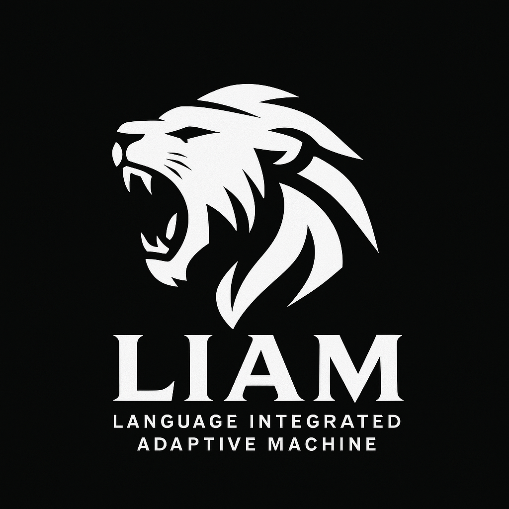
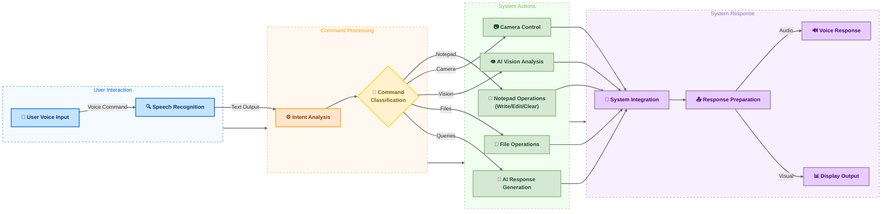

# Liam (Language Intergraded Adaptive Machine) AI

  

  
  
  
  

## Executive Summary

Liam AI is a Python-based voice assistant that enables users to control their Windows computer using natural language voice commands. It leverages advanced language models for intent recognition and can interact with system applications, especially Notepad, using robust automation and fallback strategies.

## Core Technology

Liam AI integrates several technologies:

- **Natural Language Processing**: Uses OpenAI GPT-4o or GitHub Copilot models for understanding and generating responses.
- **Speech Recognition**: Converts spoken language to text using SpeechRecognition and Google Speech API.
- **Text-to-Speech Synthesis**: Provides audible responses using Microsoft pyttsx3 or ElevenLabs (if API key is provided). ElevenLabs is preferred for higher quality, with fallback to Microsoft TTS.
- **System & Application Integration**: Automates Notepad and other applications using Windows APIs (win32gui, win32com), with multiple fallback methods (clipboard, PyAutoGUI, temp files) for reliability.
- **Waiting Sounds**: Plays short waiting sounds (e.g., "uhhh", "umm") while processing, using sounddevice and soundfile.
- **Camera Support**: Includes a camera manager for future expansion.
- **AI Vision**: Can analyze real-time camera feed to describe the scene, identify objects, and text.

## Key Capabilities

| Feature                       | Description                                                                                        |
| ----------------------------- | -------------------------------------------------------------------------------------------------- |
| **Voice Command Recognition** | Understands and processes natural language instructions                                            |
| **System Control**            | Manages Notepad and can open/close other applications (browser, terminal)                          |
| **Notepad Automation**        | Writes, appends, and clears content in Notepad using robust fallback logic                         |
| **File Operations**           | Creates text files and writes dictated content                                                     |
| **Speech Synthesis**          | Speaks responses using ElevenLabs (if available) or Microsoft TTS                                  |
| **Waiting Feedback**          | Plays short sounds while processing to indicate activity                                           |
| **AI Vision**                 | Describes the camera view in real-time, identifies objects, and reads text using OCR (if enabled). |

## Roadmap: How Liam AI Works

## Technical Requirements

- Python 3.8+
- OpenAI API key or GitHub Copilot authentication (prompted on first run if not set)
- Optional: ElevenLabs API key for enhanced voice quality
- Windows OS (Notepad automation is Windows-specific)
- Microphone and speakers

## Implementation Process

1. **Installation**:  
   Install dependencies with `pip install -r requirements.txt`.  
   For Windows, install PyAudio with:  
   `pip install pipwin && pipwin install pyaudio`
2. **Configuration**:  
   Place your API keys in a `.env` file or enter them at first launch.
   - `GITHUB_TOKEN` for Copilot
   - `OPENAI_API_KEY` for OpenAI
   - `ELEVENLABS_API_KEY` for ElevenLabs (optional)
3. **Execution**:  
   Run `python main.py` to start. Liam will greet you and listen for commands.

## Practical Applications

- **Accessibility**: Enables hands-free computer use, especially for users with mobility challenges.
- **Productivity**: Automates repetitive tasks like writing or editing text in Notepad.
- **Education**: Assists with dictation, note-taking, and quick information lookup.

## Open Source Collaboration

Liam AI is developed under the GNU General Public License v3.0, inviting community participation and contribution. The project welcomes enhancements, bug fixes, and feature additions through the standard GitHub workflow.

## Contact & Resources

- GitHub Repository: [github.com/awiones/Liam-Ai](https://github.com/awiones/Liam-Ai)
- Issue Tracking: [github.com/awiones/Liam-Ai/issues](https://github.com/awiones/Liam-Ai/issues)
- License Information: [GNU GPL v3.0](https://github.com/awiones/Liam-Ai/blob/main/LICENSE)

---

_Liam AI - Transforming computer interaction through the power of voice_
